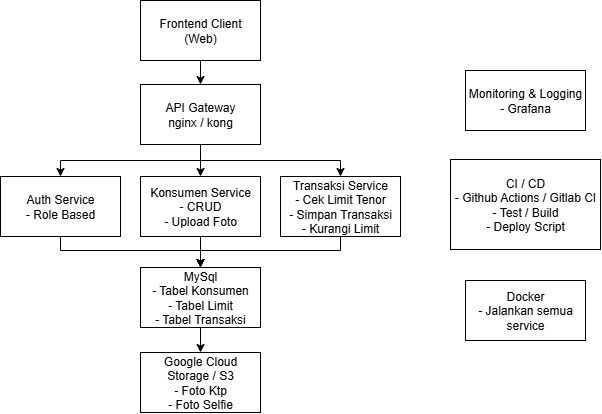
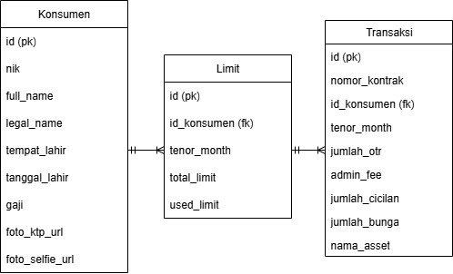

# 📦 PT XYZ Multifinance - Backend Service

Solusi implementasi backend service berdasarkan studi kasus untuk PT XYZ Multifinance.  
Aplikasi ini dibangun menggunakan **Golang**, **MySQL**, dan sudah di-_dockerize_ agar mudah dijalankan di berbagai environment.

---

## 🧩 Fitur Utama

- ✅ Auth Service – JWT Authentication (Role-Based)
- ✅ Konsumen Service – CRUD Konsumen, Upload Foto KTP & Selfie
- ✅ Transaksi Service – Cek Limit, Simpan Transaksi, Kurangi Limit
- ✅ Limit Service – Manajemen limit berdasarkan tenor dan konsumen
- ✅ MySQL Database – Otomatis ter-_migrate_
- ✅ Dockerized – Siap jalan di container
- ✅ Unit Test – Setiap service memiliki unit test-nya

---

## 🛠️ Tech Stack

- **Golang** – Gin Web Framework, GORM ORM
- **MySQL** – Relational Database
- **Docker + Docker Compose**
- **JWT** – JSON Web Token for Auth
- **Testify** – Unit Testing Framework
- **Google Cloud Storage (simulasi)** – Upload Foto

---

## 🧱 Arsitektur Aplikasi



---

## 🗃️ Entity Relationship Diagram (ERD)



---

## 🚀 Cara Menjalankan Aplikasi (dengan Docker)

1. **Clone repositori:**

```bash
git clone https://github.com/username/xyz-finance.git
cd xyz-finance
```
